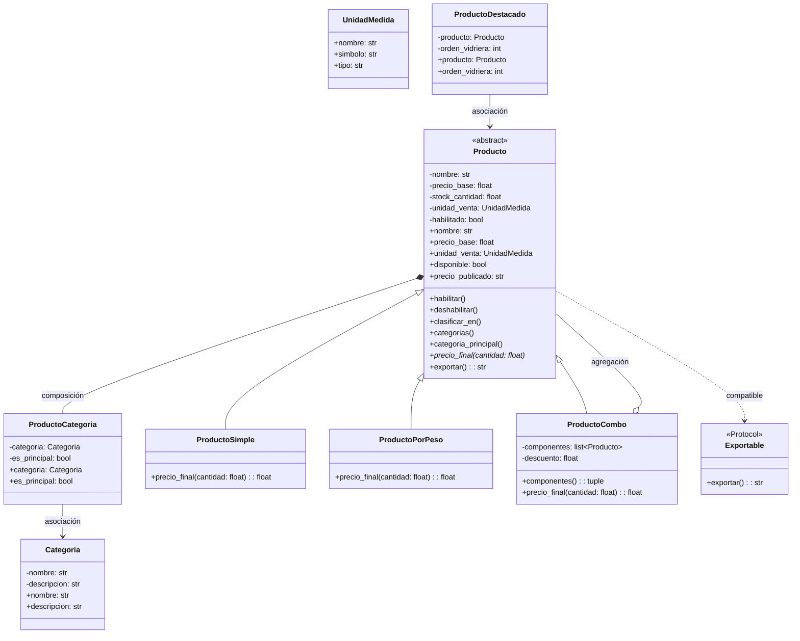

# Modelo UML

```mermaid
classDiagram

class UnidadMedida {
    +nombre: str
    +simbolo: str
    +tipo: str
}

class Categoria {
    -nombre: str
    -descripcion: str
    +nombre: str
    +descripcion: str
}

class ProductoCategoria {
    -categoria: Categoria
    -es_principal: bool
    +categoria: Categoria
    +es_principal: bool
}

class Producto {
    <<abstract>>
    -nombre: str
    -precio_base: float
    -stock_cantidad: float
    -unidad_venta: UnidadMedida
    -habilitado: bool
    +nombre: str
    +precio_base: float
    +unidad_venta: UnidadMedida
    +disponible: bool
    +precio_publicado: str
    +habilitar()
    +deshabilitar()
    +clasificar_en()
    +categorias()
    +categoria_principal()
    +precio_final(cantidad: float)*
    +exportar(): str
}

class ProductoSimple {
    +precio_final(cantidad: float): float
}

class ProductoPorPeso {
    +precio_final(cantidad: float): float
}

class ProductoCombo {
    -componentes: list~Producto~
    -descuento: float
    +componentes(): tuple
    +precio_final(cantidad: float): float
}

class ProductoDestacado {
    -producto: Producto
    -orden_vidriera: int
    +producto: Producto
    +orden_vidriera: int
}

class Exportable {
    <<Protocol>>
    +exportar(): str
}

Producto <|-- ProductoSimple
Producto <|-- ProductoPorPeso
Producto <|-- ProductoCombo

Producto *-- ProductoCategoria : composición
ProductoCategoria --> Categoria : asociación
ProductoCombo o-- Producto : agregación
ProductoDestacado --> Producto : asociación

Producto ..> Exportable : compatible
```